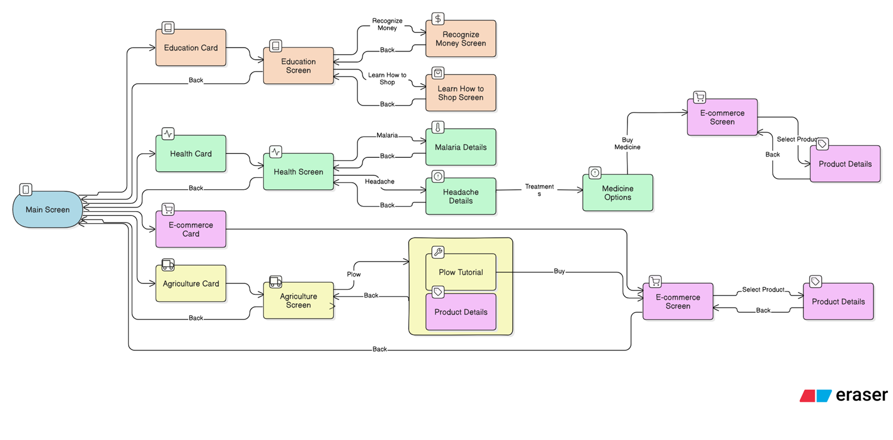

Objective:
Design a user-friendly interface with four core domains (Health, Education, Agriculture, E-commerce) that accommodates semi-literate and illiterate users through visual, audio output, and culturally sensitive interactions.
________________________________________
1. Common Design Considerations
Universal adaptations across all domains:
Design Aspect	Semi-Literate Users	Illiterate Users	Implementation in Wireframe
Language Support	Simple text in local languages (Urdu, Punjabi, etc.)	Audio-first design in local dialects	Labels in local language + 🔊 audio toggle button per screen
Visual Representation	Icons + minimal text (e.g., medicine 💊 for Health)	Culturally intuitive icons (e.g., rupee symbol for Money)	All cards/icons use universally recognizable imagery
Audio Integration	Optional audio descriptions for complex content	Audio as primary method of explanation	🔊 button on every screen to trigger audio guidance
Navigation	Text + icon labels (e.g., "Back" + ← arrow)	Tap-based, guided with visual flow arrows	Gesture-based swipes + arrow cues (e.g., → for next, ← for back)
Content Presentation	Bullet points + images (e.g., disease symptoms)	Audio narratives + animations (e.g., shopping tutorial)	Health screen: Short text + "Listen" button below each disease
Feedback Mechanisms	Text toast messages ("Order placed!")	Voice feedback ("Your order is confirmed!")	E-commerce: Audio confirmation after checkout
Offline Functionality	Cached text/images for key features	Pre-downloaded audio/visual guides	Agriculture: Offline access to tool tutorials
Key Features:
•	Haptic Feedback for critical actions (e.g., successful purchase)
•	Cultural Relevance: Local attire in illustrations (e.g., shalwar kameez for Education avatars)
________________________________________
2. Domain-Specific Considerations
A. Health Screen
User Need	Semi-Literate Adaptation	Illiterate Adaptation	Wireframe Implementation
Disease identification	Text labels + icons (e.g., "Malaria" + mosquito 🦟)	Audio: "Tap to hear about Malaria symptoms."	Disease cards with ▶️ button for audio playback
Medicine instructions	Pictograms for dosage (e.g., sun ☀️ = morning)	Audio: "Take 1 pill every morning with food."	Medicine page: Visual timeline + "Listen" option
________________________________________
B. Education Screen
User Need	Semi-Literate Adaptation	Illiterate Adaptation	Wireframe Implementation
Recognize Money	Currency images with value labels ("100 Rs")	Audio quiz: "Tap the 100 rupee note."	Interactive currency matcher with tap-to-play audio hints
Learn How to Shop	Comic-style steps (add to cart → pay)	Audio walk-through: "Now tap to select rice."	Animated shopping demo with step-by-step instructions (audio + visual arrows)
________________________________________
C. Agriculture Screen
User Need	Semi-Literate Adaptation	Illiterate Adaptation	Wireframe Implementation
Tool tutorials	Step-by-step images (e.g., plow diagram)	Audio storytelling: "Step 1: dig the soil..."	Tool demo cards with ▶️ audio explanation per step

D. E-commerce Screen
User Need	Semi-Literate Adaptation	Illiterate Adaptation	Wireframe Implementation
Product discovery	Categories with icons (e.g., "Rice" + 🌾)	Tap-based navigation with spoken guidance	Search by tapping categories; each has a ▶️ to hear name and info
Checkout process	Big buttons ("Pay Now" + cash icon)	Audio guide: "Tap the green button to pay with cash."	Confirmation screen includes large icons and audio replay option after checkout

 

